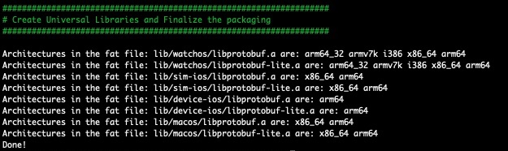

# CPP Protocol Buffers for iOS, macOS and WatchOS

Adapted from [https://github.com/sheldonth/arm64-protocolbuffers-cpp]() which was adapted from [https://gist.github.com/BennettSmith/9487468ae3375d0db0cc
]()

Build the runtime Google Protobuf Buffers v3.6.1 C++ libraries (libprotoc.a, libprotobuf.a, libprotobuf-lite.a) for:

* macOS (x86_64)
* macOS (arm64)
* iOS Device (arm64) 
* iOS Simulator (x86_64)
* iOS Simulator (arm64)
* WatchOS device (armv7k)
* WatchOS device (arm64_32)
* WatchOS device (arm64)
* WatchOS simulator (i386)
* WatchOS simulator (x86_64)
* WatchOS simulator (arm64)
* iOS Simulator Fat Mach-O
* iOS arm64 Mach-O
* WatchOS Simulator Fat Mach-O
* WatchOS device Fat Mach-O

Just clone this repo and run `./build-protofbuf.sh`

